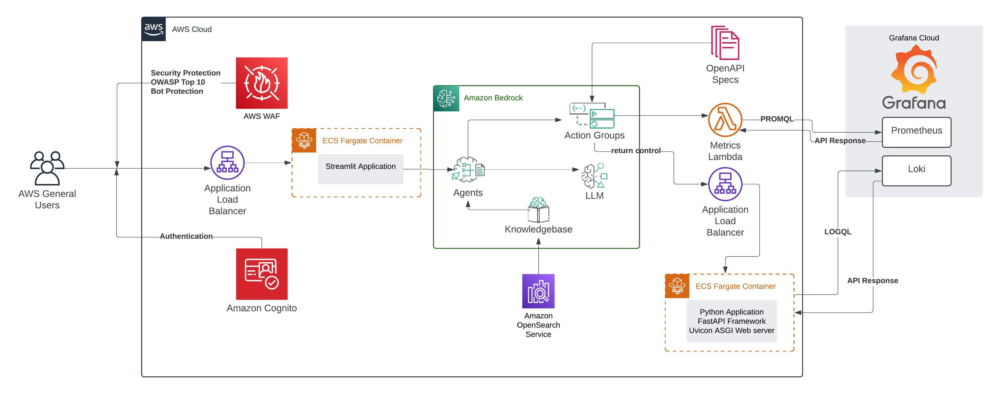

# Sample code for an Observability Assistant for Grafana Cloud using AWS Bedrock Agents

## Description

This repository hosts a sample code for creating an observability assistant for Grafana Cloud using AWS Bedrock Agents.

## Pre Deployment Actions
### Create Self Signed Certificate and Upload to ACM

* Private Key - `openssl genrsa -out ca-key.pem 2048`
* Cert - `openssl req -new -x509 -nodes -days 365    -key ca-key.pem    -out ca-cert.pem`
* Upload to ACM - `aws acm import-certificate --certificate fileb://ca-cert.pem --private-key fileb://ca-key.pem`
* Note the ARN and mention that under `config/development.yaml` file

### Adding Secrets to Secrets Manager, one each for `Loki` and `Prometheus`. The secrets MUST be in the following format

```
{
"baseUrl" : "FILL ME WITH THE BASE URL FOR YOUR LOKI OR PROMETHEUS",
"username":"FILL ME WITH THE USERNAME FOR LOKI OR PROMETHEUS",
"apikey":"FILL IN WITH THE API KEY FOR LOKI OR PROMETHEUS"
}
```

Note the secret names from secrets manager under `config/development` at the `LogsSecretName` for Loki and `MetricsSecretName` for Prometheus

### Clone the Github Repo that you need to be used as a Knowledgebase for AWS Bedrock

You **MUST** clone in `assets` folder.

The two repositories suggested are 

```
https://github.com/kubernetes/kube-state-metrics/tree/main/docs/metrics
https://github.com/grafana/loki/tree/main/docs/sources/query
https://github.com/prometheus/node_exporter
https://github.com/google/cadvisor/tree/master/docs
```

### Enable Bedrock Model Access

This solution uses `anthropic.claude-3-sonnet-20240229-v1:0"` and `amazon.titan-embed-text-v1`. Please go to AWS Console>Bedrock>Model Access and enable access to `Claude 3 Sonnet` and `Titan Embeddings G1 - Textv1.2`


## Deploy Commands

* Bootstrap CDK Environment - `cdk boostrap`
* Change the mutability of the ECR registry created. If you dont do this then docker push command may fail
* CDK Synth - `cdk synth --context environment=development`
* CDK Deploy - `cdk deploy --context environment=development --all`
* CDK Deploy (no prompt) - `cdk deploy --context environment=development --all --require-approval never`

Deployment will create the following implementation



## Post Deployment actions

* To access the UI - Create a user to login in the Cognito Pool and access the load balancer URL in the output. Use the login crendential from the Cognito Pool. Ignore the certificate warning


## Note

* If you add URLs to crawl in config/development.yaml file, then you must delete the stack `grafana-observability-assistant` (and its dependent stacks) by running `cdk destroy grafana-observability-assistant --context environment=development` and create again by running `cdk deploy grafana-observability-assistant --context environment=development`. This is because currently, the Custom Resource Lambda function which creates the Bedrock Knowledgebase (`stacks/bedrock_agent/lambda/knowledgebase.py`) doesnt implements any update method. Pull requests are appreciated.